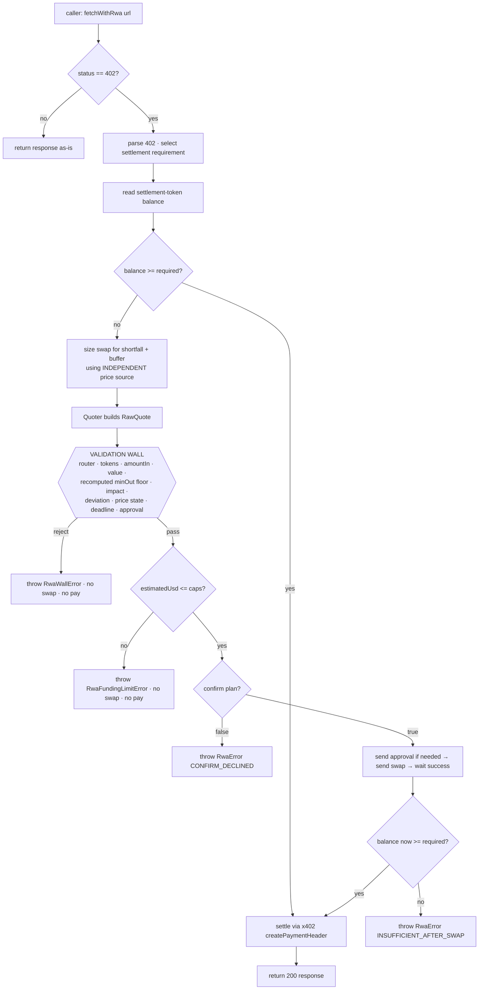
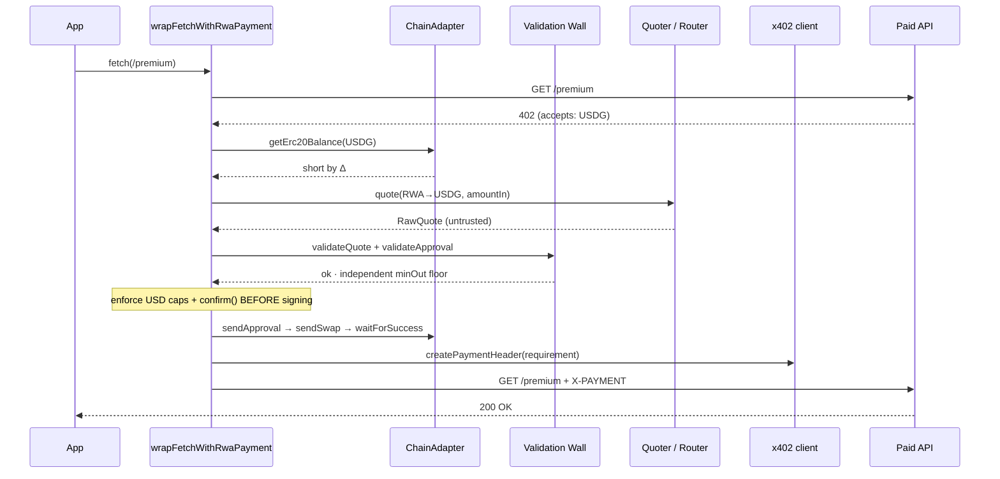

<div align="center">

# `@canopy-finance/x402-rwa`

### Pay [x402](https://x402.org) invoices with tokenized real-world assets — behind a validation wall.

An [x402](https://x402.org) buyer helper that lets an AI agent or app settle pay-per-request
invoices while holding **tokenized RWA** instead of a pre-funded stablecoin balance. On a
`402`, it swaps *just enough* RWA into the settlement stablecoin — through a ported, non-negotiable
**validation wall** — then completes the payment. Buyer-side only. Non-custodial.

<br/>

[](https://github.com/canopyfinance/x402-rwa/actions/workflows/ci.yml)
[](./LICENSE)
[](./tsconfig.json)
[](./package.json)
[](./src)
[](#-security-model)
[](./package.json)

</div>

---

## Table of contents

- [Why](#why)
- [Install](#install)
- [Quickstart](#quickstart)
- [How it works](#how-it-works)
- [Architecture](#architecture)
- [The validation wall](#-the-validation-wall)
- [Hard limits](#-hard-limits-fail-closed)
- [Security model](#-security-model)
- [API reference](#api-reference)
- [Injected dependencies](#injected-dependencies)
- [Errors](#errors)
- [Testing](#testing)
- [Limitations](#limitations-v1)
- [FAQ](#faq)
- [License](#license)

---

## Why

Agents that pay for APIs usually have to pre-fund a stablecoin float and babysit it. If the balance
runs dry mid-task, calls start failing. Meanwhile the agent may be *holding value* — tokenized
equities, treasuries, other RWA — that it can't spend on an x402 invoice.

`x402-rwa` closes that gap. It keeps your working capital in RWA and mints settlement liquidity
**on demand, per payment**, only for the exact shortfall, and only through a swap that survives a
strict validation wall. If you already hold enough stablecoin, it never swaps at all.

| | Pre-funded float | `x402-rwa` |
|---|---|---|
| Idle capital | Sits as stablecoin | Stays in yield-bearing / appreciating RWA |
| Runs dry | Payments start failing | Swaps just-in-time to cover the shortfall |
| Swap safety | N/A | Every swap passes an independent validation wall |
| Overspend risk | Manual | Hard per-payment + session USD ceilings, fail-closed |
| Custody | Depends | **None** — signs with your wallet, holds no keys/funds |

---

## Install

```bash
npm install @canopy-finance/x402-rwa viem
```

- **`x402`** is the only runtime dependency (settlement is delegated to it — never reimplemented).
- **`viem`** is a *peer* dependency, used by the optional reference `ChainAdapter` at
  `@canopy-finance/x402-rwa/viem`.
- Ships **dual ESM + CJS** with full type declarations. Node ≥ 18.

---

## Quickstart

One function wraps `fetch`. Use the result exactly like `fetch`; `402`s are handled transparently.

```ts
import { wrapFetchWithRwaPayment } from "@canopy-finance/x402-rwa";
import { createViemChainAdapter } from "@canopy-finance/x402-rwa/viem";
import { createPublicClient, createWalletClient, http } from "viem";
import { privateKeyToAccount } from "viem/accounts";

const account = privateKeyToAccount(process.env.PRIVATE_KEY as `0x${string}`);
const walletClient = createWalletClient({ account, chain: myChain, transport: http() });
const publicClient = createPublicClient({ chain: myChain, transport: http() });

const fetchWithRwa = wrapFetchWithRwaPayment(walletClient, {
  settleToken: "USDG",                      // settlement asset symbol (address from config)
  fundFrom: { symbols: ["NVDA", "TSLA"] },  // RWA holdings sellable, in priority order
  chainId: 4663,
  maxAutoSwapUsd: 50,                        // hard per-payment ceiling; above → throw, never swap
  slippagePct: 1,

  quoter: myQuoter,                          // YOU provide (DEX / aggregator)
  priceSource: myPriceSource,               // YOU provide (INDEPENDENT oracle) — feeds the wall
  chain: createViemChainAdapter({ publicClient, walletClient }),

  // Operator-provided, validated, checksummed address book — NO addresses ship in this package.
  config: {
    chainId: 4663,
    router: "0x…",                          // verified DEX router that funding swaps go through
    permit2: "0x…",                         // optional
    settleTokens: { USDG: { address: "0x…", decimals: 6 } },
    rwaTokens:    { NVDA: { address: "0x…", decimals: 18 }, TSLA: { address: "0x…", decimals: 18 } },
  },

  confirm: async (plan) => plan.estimatedUsd <= 25,  // optional human/agent approval hook
});

const res  = await fetchWithRwa("https://api.example.com/premium");
const data = await res.json();
```

Run the fully-offline demo (stubs only — no RPC, DEX, or real funds):

```bash
node example/basic.mjs
```

```text
Scenario A: sufficient USDG → pays directly, NO swap
  pay:     10000000 0x5fc5…d168 → 0x2222…2222
  result: 200 { data: 'premium payload' }

Scenario B: short USDG → swap just enough NVDA, then pay
  confirm: sell ~101500000000000000 NVDA for ~$10.15 (floor 10048500)
  approve: spender=0x8876…0904 amount=101500000000000000
  swap:    to=0x8876…0904 value=0
  pay:     10000000 0x5fc5…d168 → 0x2222…2222
  result: 200 { data: 'premium payload' }
```

---

## How it works

On an `HTTP 402`, the wrapper runs a deterministic **fund-or-pay** decision:

1. **Parse** the x402 `402` body and select the payment requirement denominated in your settlement
   token. If the resource doesn't accept it → fail closed.
2. **Read** the payer's settlement-token balance.
   - **Covered?** Pay directly via x402 client primitives. **No swap.**
   - **Short by Δ?** Continue.
3. **Size** an RWA → stablecoin *exact-input* swap for Δ plus a small buffer, using the
   **independent** price source (not the DEX quote).
4. **Build** the swap with your injected `Quoter` and run it — plus any approval — through the
   [validation wall](#-the-validation-wall). A rejection **aborts the payment**.
5. **Enforce** the hard USD ceilings and the optional `confirm()` hook *before* any signature.
6. **Execute** the user/agent-signed approval + swap, wait for on-chain success, and re-check the
   balance actually covers the invoice.
7. **Settle** the x402 payment by delegating to `x402`'s `createPaymentHeader` and retrying once.

---

## Architecture



### Payment handshake (short path)



The **core is pure and injected**: swap sizing (`planner.ts`) and the wall (`wall.ts`) have no
network, no viem, no wagmi — they're driven entirely by values and stubs, and are unit-tested in
isolation.

---

## 🧱 The validation wall

Ported from Canopy's on-chain trading wall and **not weakened**. Every funding swap — and its
approval — is checked *before the wallet is ever asked to sign*. The wall **never trusts the
quoter's slippage or `minOut`**; it recomputes an independent floor from an independently-sourced
expected output.

| Check | Rule |
|---|---|
| **Router** | `tx.to` **==** the verified router from your config |
| **Tokens** | `tokenIn` / `tokenOut` match the intended verified addresses |
| **Amount** | `amountIn` **==** the amount the helper deterministically planned to sell |
| **Value** | `tx.value == 0` for an ERC-20-in swap (no stray native value) |
| **minOut** | **≥ an independently recomputed floor** — the quoter's `minOut` is *never* trusted |
| **Impact** | `priceImpact ≤ slippagePct` **and** `≤ maxImpactPct` |
| **Deviation** | quote's expected-out vs. the **independent** `priceSource` ≤ session threshold |
| **Price state** | `LIVE` / `CLOSED` / `PAUSED` / `STALE_ERROR` gating — a paused/stale feed blocks execution regardless of off-hours settings |
| **Deadline** | present, not expired, and within a sane forward window |
| **Approval** | target is the token or verified Permit2; spender is the verified router; amount is bounded (rejects max-uint) |
| **Coverage** | even after passing, the recomputed floor must cover the shortfall or the payment aborts |

> A failing swap **aborts the payment** with `RwaWallError` (carrying `.reasons`). The helper
> **never** force-pays with a bad swap.

**Why the independent floor matters** — the DEX quote is adversarial input. A malicious or buggy
quoter could report a generous `minOut` while the calldata guarantees far less. The wall discards
the quoter's number and recomputes `floor = expectedOut × (1 − slippage)` from the independent
oracle, then rejects anything below it. This is provably not the quoter's value (see the tests).

---

## 🔒 Hard limits (fail-closed)

- **`maxAutoSwapUsd`** — an absolute per-payment ceiling. If funding a payment would exceed it, the
  helper throws `RwaFundingLimitError` **before any swap or signature**. No swap, no payment.
- **`maxSessionSwapUsd`** *(optional)* — a cumulative ceiling across the lifetime of the wrapped
  fetch.
- **Any ambiguity fails closed** — unknown token, unavailable/paused price, a floor that can't
  cover the shortfall, or insufficient RWA all throw rather than guess.

---

## 🛡️ Security model

- **Non-custodial.** The package never holds funds or private keys. It only ever asks the
  `walletClient` *you* pass to sign, and broadcasts through the `ChainAdapter` *you* provide.
- **No hardcoded addresses.** Zero mainnet addresses ship in this package. Every token, router, and
  settlement address comes from your `config`, and is validated + **checksummed** at init.
  Missing/invalid config throws `RwaConfigError` immediately.
- **Adversarial-input assumption.** The quoter's output is treated as untrusted and must pass the
  wall. The price source must be **independent** of the quoter/DEX — that independence is what makes
  the deviation check meaningful.
- **Pure, tested core.** The wall and planner are side-effect-free and covered by unit tests,
  including one test per wall failure mode.
- **Buyer-side only.** No seller middleware, so there's no server-side settlement surface here.

Found a vulnerability? See [`SECURITY.md`](./SECURITY.md).

---

## API reference

### `wrapFetchWithRwaPayment(walletClient, options) → fetch`

Returns a `fetch`-compatible function.

| Option | Type | Notes |
|---|---|---|
| `settleToken` | `string` | Settlement token **symbol**; address resolved from `config.settleTokens`. |
| `fundFrom` | `{ symbols: string[] }` | RWA symbols sellable to fund payments, in priority order. |
| `chainId` | `number` | Must match `config.chainId`. |
| `maxAutoSwapUsd` | `number` | Absolute per-payment USD ceiling. Above → throw, never swap. |
| `slippagePct` | `number` | Policy slippage `[0, 100)`; drives the recomputed `minOut` floor. |
| `quoter` | `Quoter` | Injected DEX/aggregator. |
| `priceSource` | `PriceSource` | Injected **independent** oracle; sizes swaps + feeds the wall. |
| `chain` | `ChainAdapter` | Reads balances/allowances + broadcasts user-signed txs. |
| `config` | `RwaPaymentConfig` | Validated, checksummed address book. |
| `confirm?` | `(plan) => Promise<boolean>` | Approval hook; `false` aborts **before** signing. |
| `maxSessionSwapUsd?` | `number` | Cumulative USD ceiling for the wrapped fetch's lifetime. |
| `maxImpactPct?` | `number` | Max price impact (default `3`). |
| `maxDeviationLivePct?` | `number` | Max quote-vs-oracle deviation while `LIVE` (default `2`). |
| `maxDeviationOffhoursPct?` | `number` | Max deviation off-hours (default `5`). |
| `executeOffhours?` | `boolean` | Allow execution while price state is `CLOSED` (default `false`). |
| `fundingBufferBps?` | `number` | Extra headroom over slippage when sizing (default `50`). |
| `swapDeadlineSeconds?` | `number` | Swap deadline window from now (default `600`). |
| `maxDeadlineWindowSeconds?` | `number` | Max acceptable deadline window for the wall (default `3600`). |
| `settler?` | `PaymentSettler` | Override the x402 settler (defaults to `createPaymentHeader`). |
| `fetch?` | `typeof fetch` | Override the underlying fetch (defaults to `globalThis.fetch`). |
| `now?` | `() => number` | Clock injection (ms epoch), for tests. |

### Also exported

Pure/testable building blocks: `validateQuote`, `validateApproval`, `buildFundingPlan`,
`computeShortfall`, `computeTargetOut`, `sizeAmountIn`, `ceilDiv`, `parse402`,
`selectRequirementForAsset`, `createX402Settler`, `resolveConfig`, and the `StubQuoter` /
`StubPrice` test doubles. Reference adapter: `createViemChainAdapter` from `.../viem`.

---

## Injected dependencies

```ts
interface Quoter {
  quote(req: {
    tokenIn: TokenInfo; tokenOut: TokenInfo; amountIn: bigint;
    recipient: string; slippagePct: number; deadlineSeconds: number;
  }): Promise<RawQuote>;
  // RawQuote = { tx, tokenIn, tokenOut, amountIn, expectedAmountOut,
  //              minAmountOut, priceImpactPct, deadline, approval? }
}

interface PriceSource { // MUST be independent of the quoter/DEX
  impliedAmountOut(req: { tokenIn: TokenInfo; tokenOut: TokenInfo; amountIn: bigint })
    : Promise<{ amountOut: bigint; state: "LIVE" | "PAUSED" | "CLOSED" | "STALE_ERROR" }>;
}

interface ChainAdapter { // reads balances/allowances + broadcasts user-signed txs
  ownerAddress(): Promise<string>;
  getErc20Balance(token: string, owner: string): Promise<bigint>;
  getErc20Allowance(token: string, owner: string, spender: string): Promise<bigint>;
  sendApproval(step: ApprovalStep): Promise<string>;
  sendSwap(tx: QuoteTx): Promise<string>;
  waitForSuccess(hash: string): Promise<void>; // MUST reject on revert
}
```

`StubQuoter` and `StubPrice` ship for tests/examples; `createViemChainAdapter` is a thin,
non-custodial reference implementation (viem is a peer dependency, not a hard one).

---

## Errors

| Error | Thrown when | Carries |
|---|---|---|
| `RwaConfigError` | invalid/missing config or options (at init) | — |
| `RwaWallError` | a funding swap/approval failed the validation wall | `.reasons: string[]` |
| `RwaFundingLimitError` | swap would exceed `maxAutoSwapUsd` / `maxSessionSwapUsd` | `.scope`, `.requestedUsd`, `.limitUsd` |
| `RwaError` | other failures (see `.code`) | `.code` |

`RwaError.code` ∈ `UNSUPPORTED_402 · NO_FUNDING_ROUTE · WALL_REJECTED · LIMIT_EXCEEDED ·
SESSION_LIMIT_EXCEEDED · CONFIRM_DECLINED · SWAP_FAILED · INSUFFICIENT_AFTER_SWAP · PRICE_UNAVAILABLE`.

---

## Testing

```bash
npm test          # 47 unit tests, zero network
npm run typecheck # tsc --noEmit, strict
npm run lint      # eslint
npm run build     # tsup: ESM + CJS + .d.ts / .d.cts
```

Coverage highlights: every wall failure mode (one test each), the independently-recomputed `minOut`
floor (provably ≠ the quoter's), sufficient-balance direct pay (no swap), short-balance
fund-then-pay, `maxAutoSwapUsd` / session-cap enforcement, invalid-config init throws, and the
`confirm()` abort path — all with stubs and a mocked 402 handshake.

---

## Limitations (v1)

- **Settlement token assumption.** USD sizing assumes the settlement token is a USD-pegged
  stablecoin (~$1); `maxAutoSwapUsd` / `estimatedUsd` derive from the settlement amount, not an
  independent USD oracle on the stablecoin itself.
- **Per-payment scope.** Caps/swaps are evaluated per payment; the session cap is in-memory for the
  wrapped fetch's lifetime (not persisted).
- **Exact-input funding.** Swaps are sized from the oracle plus a buffer, so you may acquire
  slightly more settlement token than owed (the remainder stays in your wallet). The recomputed
  floor must still cover the shortfall or the payment aborts.
- **Buyer-side only.** No seller/middleware is included.
- **One initial request per call.** Non-402 responses pass through untouched; a 402 triggers the
  fund-or-pay path and a single settlement retry.

---

## FAQ

**Does it ever hold my funds or keys?** No. It's non-custodial — it signs with your wallet client
and broadcasts through your chain adapter.

**What if I already hold enough stablecoin?** It pays directly and never swaps.

**Can the DEX trick it into a bad swap?** The quote is untrusted and must pass the wall, whose
`minOut` floor is recomputed independently and whose deviation check uses a separate price source.

**Which chains/DEXes are supported?** Any — everything is injected. Provide a `Quoter`,
`PriceSource`, and `ChainAdapter` (a viem reference adapter is included).

**Why is the price source required to be independent?** So the deviation check can catch a quoter
that misreports output. If it shared the DEX's price, the check would be meaningless.

---

## License

[MIT](./LICENSE) © Canopy Finance
